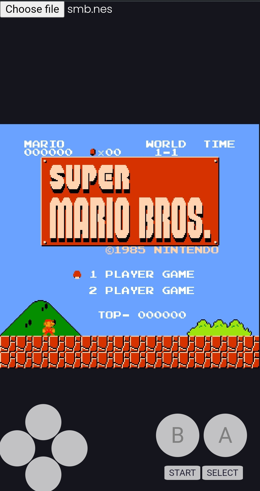

# NES Emulator

NES Emulator written in Rust and Yew/WASM. Live demo [here](https://paltamaster.ddns.net/nes). (Recommended to try on mobile browser)
<p align="center">
    
</p>

## Description

NES Emulator written in Rust for fun/learning purposes. This project is not done and I will be coming back in the future to continue it :). However it can run few games almost perfectly already.

## Emulation information

- CPU fully emulated and passes Blarggs NES test. No plans on changing CPU.
- PPU/GPU semi-functional but requires improvements. More info on TODO section.
- Audio Unit also functional but is incomplete. More info on TODO section.
- Mappers 0-3 "implemented". (NROM, MMC1, UxROM, CnROM). More info on TODO section.

## Targets

Targets desktop via minifb crate (cross-platform windowing library),
as well as web-audio-api crate (cross-platform native audio library that resembles WebAudio browser api). 
Has debugging functionality (CHR-ROM and VRAM visualization, as well as debug cli console)

Targets web as a WASM application, using Yew framework, web-sys bindings and SASS for styling. Playable in desktop and mobile but made with mobile in mind.

## Installation

Rust and Cargo are required.
Project consists of 3 cargo crates: the NES library, the desktop binary target, and the web binary target.

The desktop target uses 2 crates for windowing and audio. The required shared libraries for these crates are likely to be already installed on your system but I cant guarantee that.

The web target can be built with trunk and deployed using docker and docker-compose. Trunk is for packaging and serving the static files (html, css, js, wasm) and docker for deploying these files on the web.

## Usage

To compile and run desktop:

```bash
cargo build --release
cargo run --release --features=<insert optional feature here> <path to .nes file>
```

To compile and run web:

```bash
trunk build --release
trunk serve --release
```

The library can also be used independently of the binaries. Simply implement the NesScreen,
and NesAudio according to the target that you are using (web, desktop, mobile, embedded, punchcard, etc).

## Games that work

- Donkey Kong
- Pacman
- Super Mario Bros
- Arkanoid
- Mario Brothers
- Tennis
- Metroid
- .etc

## Games that "kinda work"

- Zelda
- Super Mario Bros 2
- Contra
- Ice Climbers
- Metal Gear
- Mega Man
- .etc

## TODO

### NES
- [ ] Game save functionality (serialize nes state)
- [ ] (Experimental) No-std support? (potential embedded target)
- [ ] (Experimental) Actor concurrent model

#### PPU
- [ ] Fix 16x8 sprites inaccurate render
- [ ] Fix invalid scrolling nametables
- [ ] Potentially a full rewrite with loopy

#### APU
- [ ] Length counter for pulse channels
- [ ] Noise channel
- [ ] DMC channel
- [ ] Potentially a full rewrite for 100% accuracy

#### Mappers
- [ ] Implement MMC3
- [ ] Fix buggy MMC1 games
- [ ] Implement other mappers...

### Desktop

- [x] Do Nothing

### Web
- [ ] Canvas requestAnimationFrame/fix fps
- [ ] Potentially webworkers + canvas
- [ ] Add demo games
- [ ] Add a menu with previously loaded games
- [ ] PWA

## Contributions

All contributions are welcome.
 
## License
[MIT](https://choosealicense.com/licenses/mit/)
